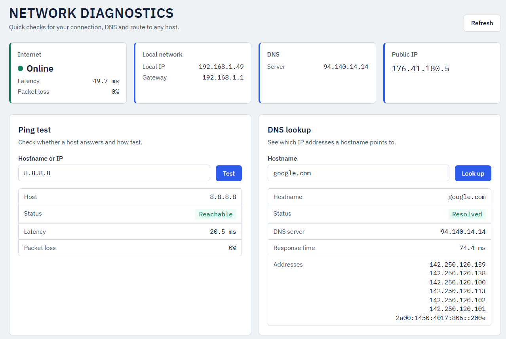
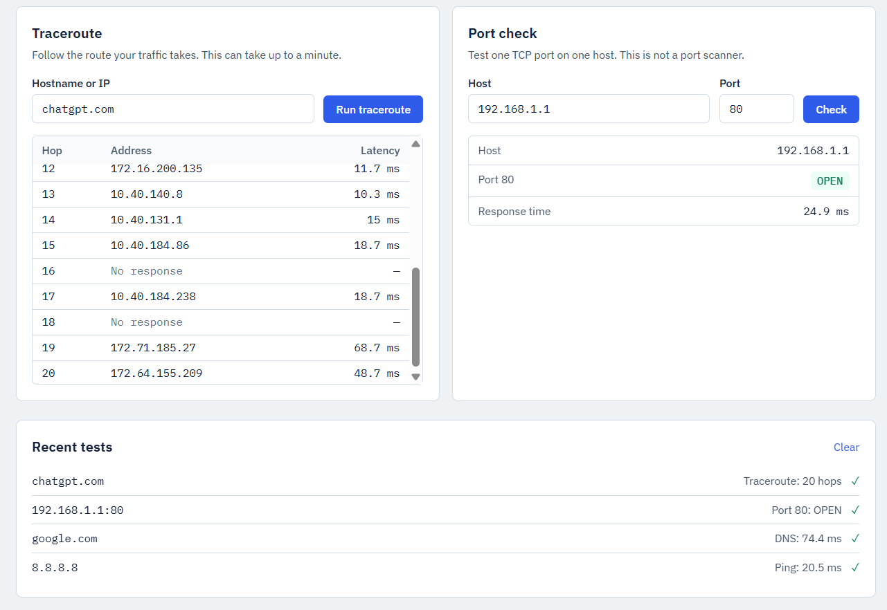

# Network Diagnostics

A small, single-page web tool for troubleshooting your network connection: connectivity check, ping, DNS lookup, traceroute and single-port checks. No database, no accounts, no background services.




## Features

- **Dashboard** – internet status, latency, packet loss, local IP, public IP, default gateway and DNS server
- **Ping test** – ICMP ping with latency and packet loss
- **DNS lookup** – resolved IPv4/IPv6 addresses, DNS server used, response time
- **Traceroute** – hop table (`tracert` on Windows, `traceroute` on Linux/macOS)
- **Port check** – one TCP connection attempt to one host and port (not a scanner)
- **Recent tests** – session-only history in the browser
- Friendly error messages; raw exceptions are never shown to the user

## Architecture

```
React + TypeScript (Vite, Tailwind)  ──/api──▶  FastAPI (Python)
                                                  ├─ validators.py   input validation
                                                  ├─ schemas.py      Pydantic models
                                                  ├─ api/routes.py   HTTP endpoints
                                                  └─ services/       ping, dns, traceroute,
                                                                     port check, gateway, ...
```

Network work happens only in the Python backend. Blocking calls run in a thread pool so the API stays responsive. In development Vite proxies `/api` to the backend; after `npm run build` the backend can serve the built frontend itself.

## Tech stack

- Python 3.12+, FastAPI, Pydantic v2, dnspython, httpx
- React 18, TypeScript, Vite, Tailwind CSS 3
- pytest for backend tests

## Project structure

```
backend/
  app/
    main.py            app setup, error handlers, static serving
    schemas.py         request/response models
    validators.py      hostname / IP / port validation
    errors.py          user-safe errors
    api/routes.py      endpoints
    services/          runner, ping, dns_lookup, traceroute, port_check,
                       local_network, public_ip, connectivity, status
  tests/               unit + API tests (network is mocked)
frontend/
  src/                 App, api client, components, hooks
```

## Installation

Requirements: Python 3.12+, Node.js 18+. On Linux, install traceroute if missing (`sudo apt install traceroute`).

```bash
# Backend
cd backend
python -m venv .venv
source .venv/bin/activate        # Windows: .venv\Scripts\activate
pip install -r requirements.txt

# Frontend
cd ../frontend
npm install
```

## Running the application

Development (two terminals):

```bash
# Terminal 1
cd backend && uvicorn app.main:app --reload --port 8000

# Terminal 2
cd frontend && npm run dev
```

Open http://localhost:5173.

Single process (after building the frontend):

```bash
cd frontend && npm run build
cd ../backend && uvicorn app.main:app --port 8000
```

Open http://localhost:8000. Interactive API docs: http://localhost:8000/docs.

## Running the tests

```bash
cd backend
pytest
```

Tests cover IP/hostname/port validation, ping/traceroute/DNS parsing, gateway detection parsing and the API. Nothing in the test suite touches the real network.

## API endpoints

| Method | Path | Body | Description |
|--------|------|------|-------------|
| GET | `/api/network/status` | – | Dashboard data (internet, IPs, gateway, DNS) |
| GET | `/api/network/local-ip` | – | Local IPv4 address |
| GET | `/api/network/public-ip` | – | Public IP (`null` if the lookup fails) |
| GET | `/api/network/gateway` | – | Default gateway |
| POST | `/api/network/ping` | `{"target": "google.com"}` | ICMP ping |
| POST | `/api/network/dns` | `{"hostname": "google.com"}` | DNS lookup |
| POST | `/api/network/traceroute` | `{"target": "google.com"}` | Traceroute |
| POST | `/api/network/port-check` | `{"host": "192.168.1.1", "port": 80}` | Single TCP port check |

Errors use the shape `{"detail": "Human-readable message"}`.

## Security considerations

- User input is validated (Pydantic + `validators.py`) before it reaches any command or socket.
- Commands run as argument lists with `shell=False`; no string is ever passed to a shell.
- Values starting with `-`, containing spaces, quotes, `;`, `|`, `&`, `$` or backticks are rejected, so option injection is not possible either.
- Ports must be integers from 1 to 65535. The port check accepts exactly one host and one port.
- Command timeouts prevent hung processes; unexpected exceptions are logged server-side and returned as a generic message.
- No port scanning, vulnerability scanning, brute force or exploit features. This is a troubleshooting tool.
- The backend can reach whatever the machine it runs on can reach. Run it locally or on a trusted network; do not expose it to the public internet without authentication.
